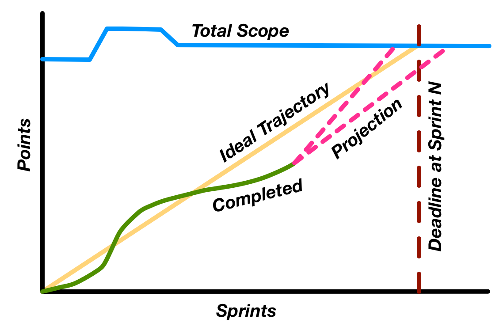

A chart that represents the work done in relation to time. The backlog is on
the vertical axis while the time is on the horizontal axis. 
Is is useful for predicting when all work will be be completed. 
Its also useful for determining teams velocity.

- If the actual line is above the ideal line, that means that we are running
late and we might miss the schedule. 

- If the actual line is below the ideal line, that means that we are faster than
  the planned velocity and we will be done earlier. 

## Burnup chart
The burnup chart focuses on predicting whether we can reach a certain amount of
work (points) until a deadline. It tries to predict if we are not the right
track or not. The horizontal axis has the sprints, and the vertical has the
points

